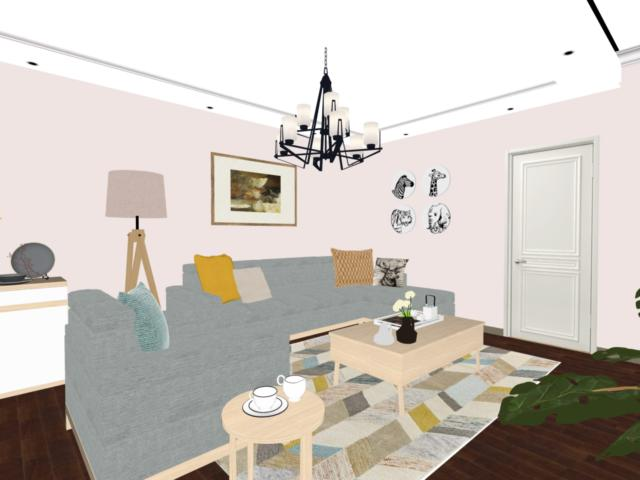

# Photorealistic Rendered Intrinsic Dataset
This dataset is a synthetic dataset for intrinsic decompostion, which provides photorealistic rendered images with ground truth albeo images and shading images.


## File structure
There are about 20K samples in this dataset and we split them to train/test splits, which are respectively given in `resized_data/train_list.txt` and `resized_data/val_list.txt`. 

In folder `resized-data`, we provide resized images used during the network training for lowering memory costs. These images are resized to a half of their original sizes. There are several sub-folders:

* `input-resize`: this folder contains all of the input images.
* `diffuse-resize`: this folder contains all of the corresponding albedo images.
* `shading-resize`: this folder contains all of the corresponding shading images.
* `mask-resize`: this folder contains all of the corresponding mask images, which are calculated and used for masking out some areas during loss calculation, such as areas with self-illumination, refraction, etc. 

In folder `raw-data`, we provide the original high resolution images, where the data is organized in a similar way.

## Data example
An example from our dataset is given below. 'xxx' denotes the id of a data sample. 

**Input** ('resized_data/input-resize/xxx.input-resize.png')


**Albedo** ('resized_data/diffuse-resize/xxx.diffuse-resize.png')



**Shading** ('resized_data/shading-resize/xxx.shading-resize.png'):


## Download
Please download the data from Baidu Netdisk with the `link` and `password` given in `download_address.txt`.

## Citation
If you use this dataset for your research, please consider citing our paper: 
```
Wang Y J, Fan Q N, Li K, Chen D D, Yang J Y, Lu J Z, Dani Lischinski, Chen B Q . 2022. 
High quality rendered dataset and non-local graph convolutional network for intrinsic image decomposition. 
Journal of Image and Graphics, 27(2): 404-420. 
(王玉洁, 樊庆楠, 李坤, 陈冬冬, 杨敬钰, 卢健智, Dani Lischinski, 陈宝权. 2022. 
面向本征图像分解的高质量渲染数据集与非局部卷积网络. 中国图象图形学报, 27(2): 404-420.) 
[DOI: 10.11834/jig.210705]
```


## Contact
If you have any questions, please feel free to contact us via email: `yujiew.cn@gmail.com`.
